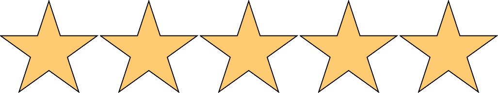

# CSE 13S - Comp Sys and C Program

C programming, command line, shell programming, editors, debuggers, source code control, and other tools. Basic computer systems, algorithm design and development, data types, program structures. Develops understanding of process model, compile-link-execute build cycle, language-machine interface, memory, and data representation. Students cannot receive credit for both CSE 13S and CSE 13E. Course is 7 units (5 + 2) with integrated laboratory.

Prerequisites:

- [CSE 12](CSE12.md) or BME 160

Quality: 

Difficulty: 

Remarks:

- Language(s) used: C
- Hardest lower division class with Professor Long
- Students say Professor Rudnick is slightly easier, albeit still difficult