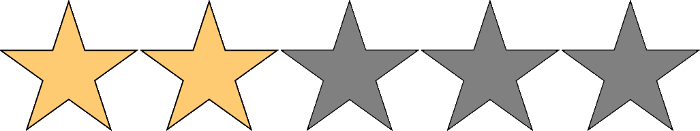

# CSE 185S - Technical Writing and Communication in Computer Science

Writing by engineers and computer scientists, not to general audiences, but to engineers, engineering managers, and technical writers. Exercises include job application and resume, in-code documentation, algorithm description, naive-user documentation, library puzzle, survey article, proposal, progress report, formal technical report, and oral presentation. Students cannot receive credit for this course and CSE 185E. (Formerly Computer Engineering 185)

Quality: 

Difficulty: 

Remarks:

- Easy class to pass
- Allow for resubmission for higher grade unlimited times until end of quarter
- Always taught by Professor Gerald Moulds
- Time consuming, but learn some useful skills like creating resumes, LaTeX, etc